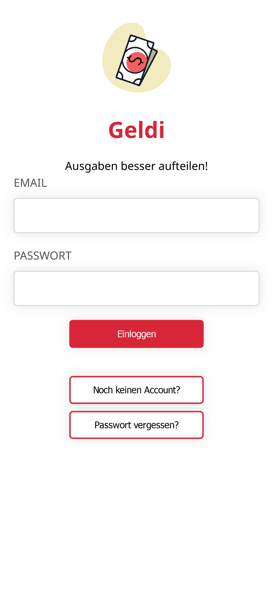
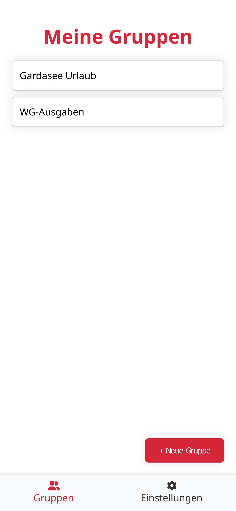
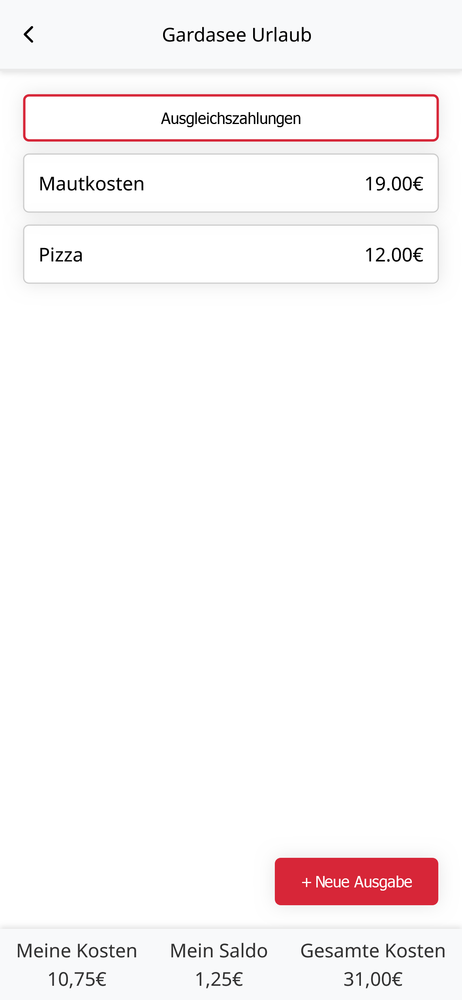
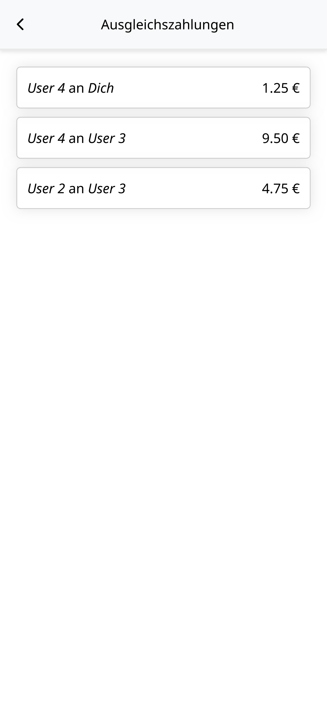

# App Screenshots

| Login Page                                                             | Groups                                                                  | Group                                                                 | Compensation Payments                                                                                 |
| ---------------------------------------------------------------------- | ----------------------------------------------------------------------- | --------------------------------------------------------------------- | ----------------------------------------------------------------------------------------------------- |
|  |  |  |  |

# Setup

## Requirements

- MySQL
- nodejs (including npm)

## Backend Setup

1. `cd ./backend/` Change to the backend folder
2. `npm install` Install the necessary dependencies
3. `node setupEnvFile.cjs` Setup the file for environmental variables
4. Create a MySQL database and fill the newly created .env file with values
5. `npm run dev` Start the server in a development environment

## Frondend Setup

1. `cd ./frontend_v2` Change to the frontend folder
2. `npm install` Install the necessary dependencies
3. `npm run dev` Start the server in a development environment
